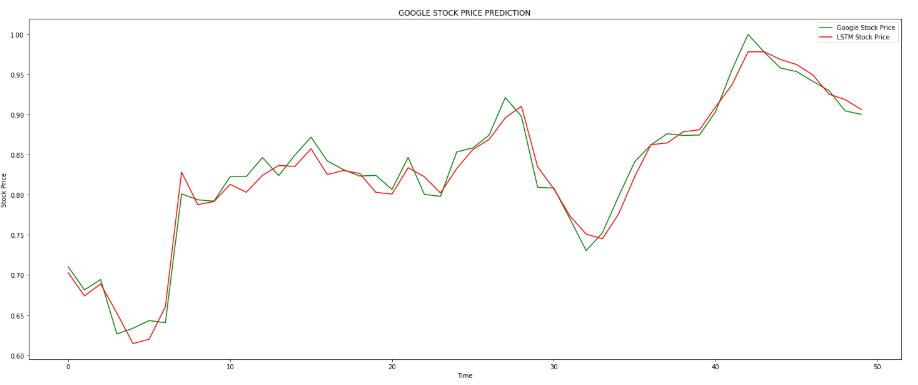

# Google-Stock-Prediction-Using-LSTM

We used Long Short-Term Memory networks (LSTM) for our prediction. We have predicted the price of google stock.

### Technologies Used
```
1.Keras

2.LSTM

3.Tensorflow
```

### Screenshot





### Author 
```
Rahul Kumar Patro
```


